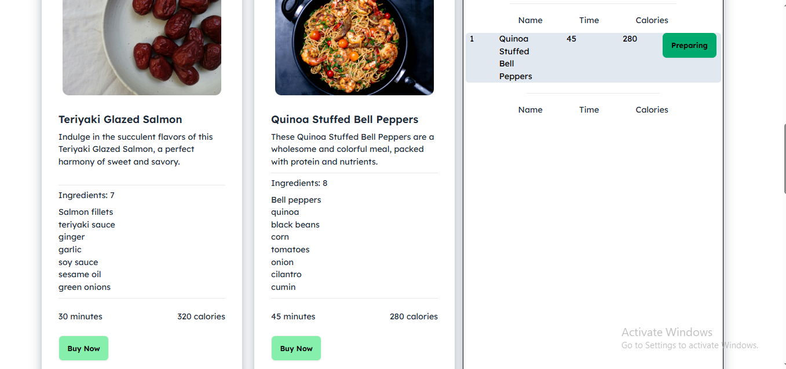

# 🍳 DotCook



Welcome to **DotCook** — a simple and modern recipe website built with React, Tailwind CSS, and Vite.  
Check out the live version below 👇

**[DotCook](https://dotcook.netlify.app/)**

---

### About
**DotCook** is a small web project that displays recipe ideas with a clean and responsive design.  
It focuses on minimalism, fast performance, and an enjoyable browsing experience using modern front-end tools.

---

### 🛠️ Built With
- **React (Vite)**  
- **JavaScript (ES6)**  
- **Tailwind CSS**  
- **HTML5**  
- **CSS3**

---

### 💡 Features
- Responsive layout for all screen sizes  
- Clean and modern user interface  
- Fast development setup with Vite  
- Lightweight and easy to customize  

---

### Run Locally

To run this project on your local machine:

```bash
git clone https://github.com/akibhasanniloy/DotCook.git
cd DotCook
npm install
npm run dev
